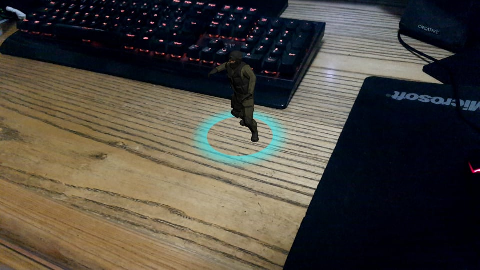
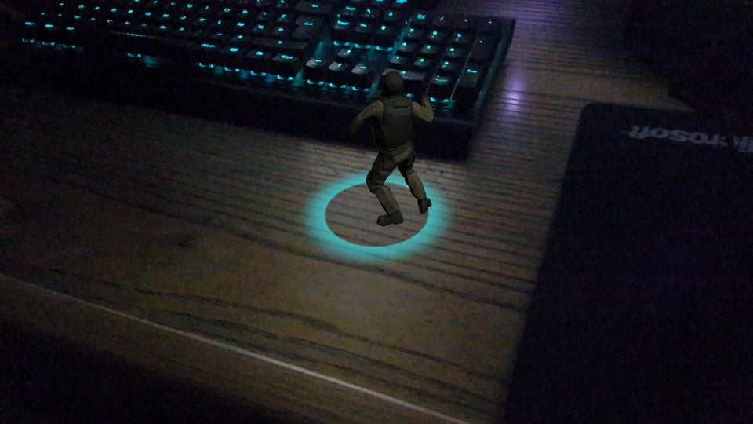
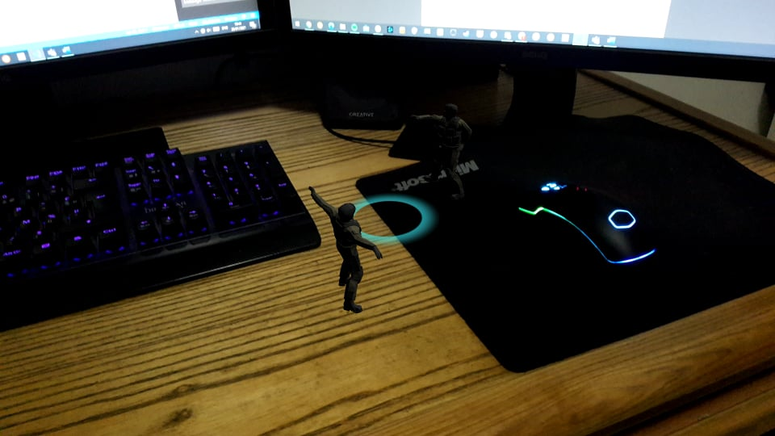
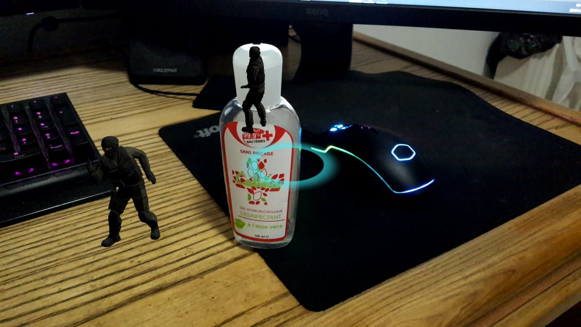

# Repository for Augmented Reality Practice Work

## Practice Work 1: Vuforia
**Author :** Chadi FENDRI

> This project was done in *Unity version 2020.1.12f11*

I downloaded the vuforia engine seperately and added it manually. It should be placed under `\TP1-AR\Packages\com.ptc.vuforia.engine-9.5.4\Package`

The source code for this project can be found in the `\TP1-AR` folder.

The target image used in this project can be found in `\TP1-AR\Misc\Target Image`

The built APK for this project can be found in `\TP1-AR\Misc\APK`

`\TP1-AR\Misc\Screenshots` Contains some screenshots of this project working, tested on a *Samsung Galaxy A50*

## Practice Work 2: ARFoundation
**Authors :** 
* Chadi FENDRI
* Mohamed Wassim BENZARTI

> This project was done in *Unity version 2020.1.12f11*

We didn't encounter any particular problem during this practicums

The source code for this project can be found in the `\TP2-AR` folder.

The built APK for this project can be found in `\TP2-AR\Misc\APK`

`\TP2-AR\Misc\Screenshots` Contains some screenshots of this project working, tested on a *Samsung Galaxy S7*

### Answer to Questions :
#### 2) What are the different observations in the real world scene compared to the virtual object?
* **Lighting :** 
The lighting of the objects is static and doesn't take into account the actual light in the scene.  
*Render in a bright room:*
 
*Render in a dark room:*
 
In the two screenshots above, we can see that even though the brightness of the room changes, the lighting of the render stays the same.  

* **Collisions :** 
There is no collision between the virtual objects and the real ones. After adding a virtual object to the scene, it doesn't interact with the real world objects and it only keeps track of its position. 
*Two virtual objects with no collision:*
 
*Two virtual objects with real object between the camera and one of them:*
 
As we can see in the screenshots above, putting an object between the camera and a virtual object doesn't obscure it but keeps it floating in the same place.   
* **Static Error :**
There are no static errors occurred during the testing.  

* **Dynamic Error :**
Latency: When we put many agents in the scene, the rendering of the image becomes resource intensive. This has a bad effect on the co-existance between the virtual world and the real world.

#### 3) What are the technical solutions developed by ARCore to solve these problems?
* **Lighting &rarr; Solution: Light Estimation**
ARCore introduces the concept of light estimation to solve the lighting problem in AR. It does this by analyzing the video feed it gets and uses its frames to extract any visual cue. Then, it uses this data to simulate the same lighting conditions in the virtual scene. This makes the virtual objects feel more integrated within the real world and thus it enhances the immersion of the users.  
* **Collisions &rarr; Solution: Depth Understanding**
To solve the problem of collisions between the real objects and the virtual ones, ARCore uses Depth API. This technique uses a supported device's camera feed to generate a depth map. The depth map determines how far each pixel is from the camera. As such, by using a depth map, ARCore is able to make real world objects obscure virtual objects accurately if they come between them and the camera.  

* **Dynamic Error &rarr; Solution: Anchors** To solve the problem of latency ARCore uses Anchors, having fewer anchors will drastically improve performance and Motion-To-Photon latency. 

    When it comes to applications with other User Interface components, ARCore uses **AR Sessions** to improve performance. An AR Session starts when the device starts tacking everything around by using Camera and device data. Keeping AR experiences on a seperate scene (AR Session) will avoid using up resources and battery life when tracking is not needed.